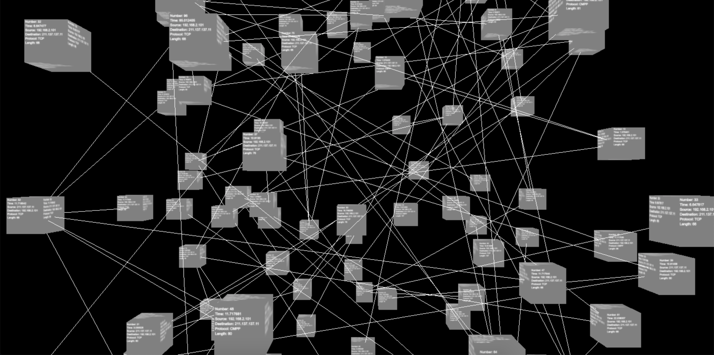

# TrafficVisualization
CybernetIQ's second challenge: Packet traffic visualization using three.js  
**Live preview**: https://rickydam.com/TrafficVisualization

# Screenshot

# Building Process
1. Followed the three.js tutorial to learn how to create and render a scene, then animate a cube https://threejs.org/docs/index.html#manual/en/introduction/Creating-a-scene
2. Created my basic rectangular prism node of gray color
3. Decided that since the nodes will be displayed on a 3D-plane, all sides need to be readable, so I changed it to a cube
4. Learned that to get text onto a BoxGeometry I needed to create a canvas, put text on it, and then use that canvas as the texture of the BoxGeometry
5. Created and used a basic texture with a canvas that showed "Hello world!"
6. Modified the canvas to use the device pixel ratio for higher quality textures
7. Implemented TrackballControls which allowed for the zoom & pan features that I saw on the site's featured three.js projects
8. Loaded the local JSON file using a function with a callback since it is done asynchronously
9. Looped through the JSON data to dynamically create the nodes
10. Used the random function of the built-in Math library to generate random coordinate values to spread out the nodes
11. Stored all the JSON data in a global variable as node objects to reference later
12. Also stored the randomly generated x, y, and z coordinates into the node objects to use when drawing the relationships
13. Added a function to draw the relationships using vertices at the cube coordinates of the source packet and the destination packets

# Challenges
* Scene not rendering when inside a function
* Local JSON file blocked by CORS policy
* New build version causes upside down canvas text on the texture

# Problems
* Overlap of nodes
  * Since the x, y, and z coordinates are generated from -10 to +20, it is possible that some cubes may overlap
* Packet relationships
  * All lines are currently only of color white
  * Current implementation will only work for a single sender and a single receiver

# Libraries Used
* three.js
* TrackballControls from three.js
